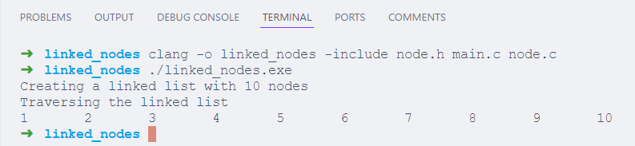
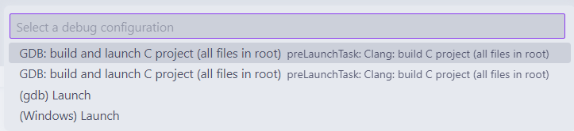
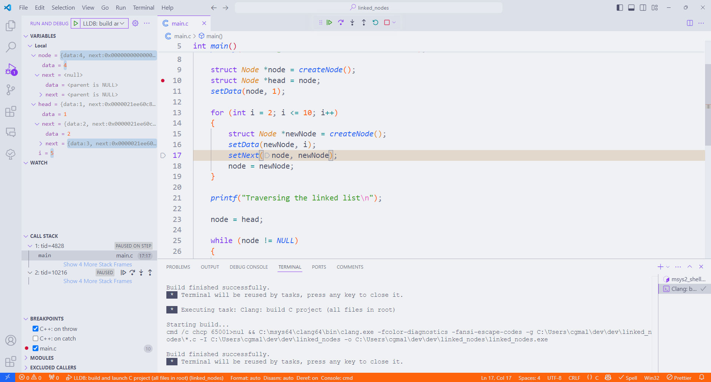

# Criando um projeto em C no Visual Studio Code

O Visual Studio Code é um editor de texto muito poderoso, com várias extensões que facilitam o desenvolvimento de software.

Vamos criar um projeto em C no Visual Studio Code e adicionar extensões que facilitam a compilação e execução do código.

Abra o Ícone de Configurações do Visual Studio Code e clique em **Profiles** (ou Perfis, se estiver em português).

Clique em **New Profile** e o nomeie de MSYS2 Clang64.
Clique em **Create**.


**Selecione** o perfil, clicando no ícone de "checkmark" do lado do neu nome na lista.
É importante que o perfil correto esteja selecionado para que as configurações sejam aplicadas.


## Extensões

Pesquise no menu de **extensões** do Visual Studio Code e instale as seguintes:

- [Git Graph](https://marketplace.visualstudio.com/items?itemName=mhutchie.git-graph): visualiza o histórico de commits do Git.
- [C/C++](https://marketplace.visualstudio.com/items?itemName=ms-vscode.cpptools): fornece suporte para desenvolvimento em C e C++.

Atenção: ainda **não instale** a extensão `C/C++ Extension Pack`!
Ela inclui outras extensões que serão explicadas mais adiante.

Abra a **paleta de comandos** do Visual Studio Code com `Ctrl` + `Shift` + `P` e pesquise por **Preferences: Open User Settings (JSON)**, ou o equivalente em português.

Copie o conteúdo da pasta [`/config/initial_settings.json`](/config/initial_settings.json) deste repositório e cole no arquivo `settings.json` do Visual Studio Code.
Perceba que, abrindo o arquivo `settings.json` quando se usa o perfil MSYS2 Clang64, você verá as configurações específicas para este perfil, e não as configurações gerais do Visual Studio Code.
É este mesmo o objetivo que temos.

A configuração definida no arquivo `settings.json` faz o seguinte:

- O compilador Clang é definido como o compilador padrão.
- Bibliotecas do Clang são incluídas no Path do terminal do Visual Studio Code.
- O terminal integrado do Visual Studio Code é definido como o terminal do MSYS2.

Salve o arquivo e feche o Visual Studio Code.

## Compilando o projeto

Crie um novo diretório chamado `linked_nodes` dentro de `~/dev`.
Acesse-o e abra o Visual Studio Code com o comando `code .`.

Neste repositório, disponibilizamos um projeto em C que simula uma lista encadeada de nós.
Você pode encontrá-lo na pasta [`/code/linked_nodes`](/code/linked_nodes) deste repositório.
Copie todos os arquivos para o diretório `linked_nodes` que você criou.

Você verá que o Visual Studio Code já reconhece o projeto e identifica as bibliotecas e funções utilizadas.

Vamos compilar o projeto pelo terminal integrado do Visual Studio Code.
Abra o terminal integrado com `Ctrl` + `` ` `` e execute o comando abaixo:

```bash
clang main.c node.c -include node.h -o linked_nodes
```

Esse comando compila os arquivos `main.c` e `node.c`, incluindo o arquivo de cabeçalho `node.h`, e gera o arquivo executável `linked_nodes`.
Para executar o programa, digite `./linked_nodes` e pressione `Enter`.



## Depurando o projeto

Okay, podemos compilar o projeto pelo terminal do Visual Studio Code.
Mas e se quisermos o fazer por uma interface gráfica?
E se quisermos depurar o código, ou seja, executá-lo passo a passo e inspecionar variáveis?

Primeiramente, vamos instalar o **GDB**, que é um depurador de código para C e C++.
Execute o comando abaixo no terminal do MSYS2 e confirme:

```bash
pacman -S mingw-w64-clang-x86_64-gdb
```

### Compilando pela interface gráfica

Aceite a instalação, e reabra o Visual Studio Code no diretório `linked_nodes`.

Nele, crie uma pasta chamada `.vscode`.
Dentro dela, crie um arquivo chamado `tasks.json` e adicione o conteúdo do arquivo [`/code/linked_nodes/.vscode/tasks.json`](/code/linked_nodes/.vscode/tasks.json) deste repositório.

O que ele faz é definir uma tarefa chamada `Clang: build C project (all files in root)` que compila o projeto com o Clang, incluindo todos os arquivos de cabeçalho e todos os arquivos de código definidos na raiz do projeto.
O executável gerado terá o nome da pasta aberta no Visual Studio Code.

Você pode executar a tarefa `Clang: build C project (all files in root)` pressionando `Ctrl` + `Shift` + `B`, ou acessando pela **Paleta de Comandos** a opção `Tasks: Run Build Task`.

### Rodando o programa pela interface gráfica

Agora precisamos definir um arquivo de configuração para a depuração do projeto.
Crie um arquivo chamado `launch.json` dentro da pasta `.vscode` e adicione o conteúdo do arquivo [`/code/linked_nodes/.vscode/launch.json`](/code/linked_nodes/.vscode/launch.json) deste repositório.

Para rodar o programa, abra o arquivo `main.c` e clique na setinha ao lado do botão de **play** localizado no canto superior direito da janela.
Seleciona a opção "Debug C/C++ file".


O Visual Studio Code compilará pedirá para você selecionar a configuração de depuração.
Selecione **GDB: build and launch C project (all files in root)**.



Essa ação executará a tarefa que definimos no arquivo `tasks.json` e gerará o executável `linked_nodes` na pasta do projeto.
Em seguida, abrirá o depurador em um terminal separado.

Caso você coloque um ponto de interrupção no código, o programa será executado até que aquela linha seja atingida.
Quando o depurador pausa, você pode inspecionar variáveis, ver o valor de ponteiros, e utilizar outras ferramentas que o sistema de depuração oferece.



### Configurações globais

Felizmente, o Visual Studio Code permite que você salve as configurações de compilação e depuração em arquivos globais, para serem utilizadas em outros projetos.

As tarefas e as configurações de depuração, quando configuradas tendo selecionado o perfil **MSYS2 Clang64**, serão salvas apenas para esse perfil.
Dessa forma, eliminamos o risco de conflitos entre diferentes configurações de compilação e depuração.
Mas lembre-se de sempre **selecionar este perfil** ao abrir o Visual Studio Code para que as configurações sejam aplicadas.

Para salvar o `launch.json`, você deve criar uma nova entrada no arquivo `settings.json` do Visual Studio Code, chamada `"launch"`.
Dentro dela, você pode definir todas as configurações de depuração que você deseja que sejam globais.

Lembre-se: você pode editar as configurações do perfil MSYS2 Clang64 ao abrir a paleta de comandos e pesquisar por **Preferences: Open User Settings (JSON)**.
Substitua o conteúdo do arquivo `settings.json` pelo conteúdo do arquivo [`/config/c_settings.json`](/config/c_settings.json) deste repositório.
Nele, já adicionamos a configuração global de depuração.


Para as tarefas de compilação, você deve abrir a **Paleta de Comandos** do Visual Studio Code e pesquisar por **Tasks: Open User Tasks (JSON)**.
Então, se necessário, selecione **Other** e cole o conteúdo do arquivo [`/config/c_tasks.json`](/config/c_tasks.json) deste repositório.


---

> ➡️ [**Próximo capítulo**](/chapters/compiling_cpp_project/text.md)\
> ⬅️ [**Capítulo anterior**](/chapters/msys2_to_path/text.md)\
> 🏠 [**Página inicial**](/README.md)
