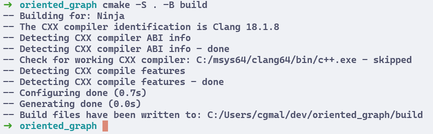

# Usando o CMake

O CMake é uma ferramenta de código aberto que permite a automação do processo de compilação de projetos em C e C++.
Ele gera arquivos de configuração para diferentes ambientes de desenvolvimento, como Visual Studio, Makefile, Ninja, entre outros.

Para nós, o CMake será útil para compilar projetos mais complexos, que envolvem vários arquivos em diferentes diretórios e dependências externas.

## Instalando o CMake

Para instalar o CMake, execute o comando abaixo no terminal do MSYS2:

```bash
pacman -S mingw-w64-clang-x86_64-cmake
```

Aceite a instalação e confirme a instalação dos pacotes necessários.
Você pode verificar se o CMake foi instalado corretamente executando o comando `cmake --version`.

## Extensões

Para trabalhar com o CMake no Visual Studio Code, é recomendado instalar algumas extensões que são inclusas no pacote `C/C++ Extension Pack`.

Lembre-se de selecionar o perfil `MSYS2 Clang64` no Visual Studio Code antes de instalar a extensão.
Pesquise pela extensão [`C/C++ Extension Pack`](https://marketplace.visualstudio.com/items?itemName=ms-vscode.cpptools-extension-pack) e a instale.

Esse pacote inclui as seguintes extensões:

- [C/C++](https://marketplace.visualstudio.com/items?itemName=ms-vscode.cpptools): fornece suporte para desenvolvimento em C e C++.
- [C/C++ Themes](https://marketplace.visualstudio.com/items?itemName=ms-vscode.cpptools-themes): fornece temas de cores para o Visual Studio Code.
- [CMake](https://marketplace.visualstudio.com/items?itemName=twxs.cmake): fornece suporte para desenvolvimento com CMake.
- [CMake Tools](https://marketplace.visualstudio.com/items?itemName=ms-vscode.cmake-tools): fornece ferramentas para trabalhar com projetos CMake.

Caso seja disparado um pop-up pedindo para selecionar um kit de compilação, selecione o kit `Clang`.


## Criando o projeto

Crie um novo diretório chamado `oriented_graph` dentro de `~/dev`.
Acesse-o e abra o Visual Studio Code com o comando `code .`.

Dentro do diretório `oriented_graph`, crie um arquivo `main.cpp` e três pastas: `node`, `edge` e `graph`.
Cada pasta deve conter um arquivo `.cpp` e um arquivo `.h` com o mesmo nome da pasta.
**Ignore** os arquivos `CMakeLists.txt` por enquanto.

Você pode encontrar o código completo deste projeto na pasta [`/code/oriented_graph`](/code/graph) deste repositório.
Copie o código de cada arquivo para o seu projeto.

Assim como antes, você pode compilar esse projeto diretamente pelo `clang++` ou utilizando os arquivos `tasks.json` e `launch.json` do Visual Studio Code.

O comando de compilação é o seguinte:

```bash
clang++ main.cpp node/node.cpp edge/edge.cpp graph/graph.cpp -I node -I edge -I graph -o oriented_graph
```

Ao executar o programa, você verá a seguinte saída: `1 3 4 5 2`.
Ela representa a ordem de visitação dos nós do grafo em uma busca em profundidade iniciando pelo nó 1.

## Configurando o CMake

Uau, esses comandos estão ficando grandes!
A situação fica ainda mais complicada conforme se aumenta o número de arquivos e dependências do projeto.
Felizmente, podemos simplificar esse gerenciamento com o CMake.

### Criando o arquivo `CMakeLists.txt`

Crie um arquivo chamado `CMakeLists.txt` na raiz da pasta `oriented_graph`.
Atente-se à letras maiúsculas e minúsculas no nome do arquivo, ele precisa estar escrito exatamente como acima.

Este arquivo é responsável por definir as configurações do projeto e as dependências necessárias para a compilação.
Seu código completo está disponível em [`/code/oriented_graph/CMakeLists.txt`](/code/graph/CMakeLists.txt).

### Versões

Vamos passar trecho por trecho do arquivo.

Primeiramente, é necessário definir a versão mínima do CMake que será utilizada.
Na época de escrita deste guia, a versão 3.30.3 era a mais recente disponível para o MSYS2.

Nós podemos definir um intervalo de versões suportadas, para garantir que o projeto seja compilado corretamente em diferentes ambientes.
Isso é feito com o comando `cmake_minimum_required`.

Em seguida, conferimos a restrição de versão do CMake e ajustamos a política de compatibilidade com versões anteriores, caso necessário.

```cmake
# Version
cmake_minimum_required(VERSION 3.12...3.30)

if (${CMAKE_VERSION} VERSION_LESS 3.12)
    cmake_policy(VERSION ${CMAKE_MAJOR_VERSION}.${CMAKE_MINOR_VERSION})
endif ()
```

### Definições do projeto

O próximo passo é definir o nome do projeto e a linguagem de programação utilizada.
Este nome será utilizado como identificador para associar a ele dependências, executáveis e outras configurações.
Para o CMake, a linguagem C++ é identificada pela sigla `CXX`.

```cmake
# Project
project(oriented_graph
        LANGUAGES CXX
)
```

### Configurações do ambiente

Definimos então algumas variáveis que definem o ambiente de compilação.
Aqui, estamos definindo o padrão C++23, que é o mais recente disponível no momento da escrita deste guia.
Essa versão da linguagem traz diversas melhorias e novas funcionalidades, aprimorando a segurança e a eficiência do código.

O segundo comando desativa extensões de linguagem que não são padrão, garantindo que o código seja compatível com diferentes compiladores.
O terceiro, por sua vez, define que a versão C++23 é obrigatória.
Dessa forma, o CMake irá gerar um erro caso a versão do compilador não seja compatível com o padrão.

```cmake
# Environment
set(CMAKE_CXX_STANDARD 23)
set(CMAKE_CXX_EXTENSIONS OFF)
set(CMAKE_CXX_STANDARD_REQUIRED ON)
```

### Flags de compilação

Adicionamos algumas flags de compilação para garantir que o código seja compilado de forma otimizada e segura.
`-Wall` e `-Wextra` habilitam avisos de compilação que podem indicar problemas no código.
`-pedantic` habilita avisos adicionais, que podem ser úteis para garantir a portabilidade do código.

```cmake
# Compilation flags
set(CMAKE_CXX_FLAGS "${CMAKE_CXX_FLAGS} -Wall -Wextra -pedantic")
```

### Diretórios

Agora, devemos definir todos os diretórios que incluem código fonte e arquivos de cabeçalho do projeto.
Esses diretórios são adicionados ao projeto com o comando `add_subdirectory`, que busca por arquivos `CMakeLists.txt` dentro de cada pasta e os executa.

Dessa forma, é possível dividir o projeto em diferentes módulos e gerenciar suas dependências de forma independente.

Os comandos abaixo incluem os três diretórios `node`, `edge` e `graph` que criamos.

```cmake
# Directories
add_subdirectory(node)
add_subdirectory(edge)
add_subdirectory(graph)
```

Atente-se que, para cada diretório, é necessário criar um arquivo `CMakeLists.txt` que defina as configurações específicas daquele módulo.

Além disso, se uma dessas pastas definir outra pasta dentro de si, é necessário identificar essa segunda com o comando `add_subdirectory` no arquivo `CMakeLists.txt` da pasta pai.

Ou seja, se a pasta `node` tivesse uma subpasta `data_type`, por exemplo, seria necessário adicionar `add_subdirectory(data_type)` no arquivo `node/CMakeLists.txt`.

### Executável

Então, definimos o executável que será gerado a partir do projeto.
O comando `add_executable` recebe o nome do executável e a lista de arquivos `.cpp` que compõem aquele módulo.

No nosso caso, chamaremos o executável de `oriented_graph` e ele será composto apenas pelo arquivo `main.cpp`.

```cmake
# Executable
add_executable(oriented_graph main.cpp)
```

### Incluindo o módulo

Para cada módulo, é necessário incluir os arquivos de cabeçalho e de código fonte no projeto.
Fazemos isso com o comando `target_include_directories`.
Ele recebe o nome do executável e uma variável que representa a pasta do arquivo `CMakeLists.txt` atual.

```cmake
# Include module
target_include_directories(oriented_graph
    PUBLIC
        ${CMAKE_CURRENT_LIST_DIR}
)
```

## Configurando os diretórios

Crie um arquivo `CMakeLists.txt` dentro de cada pasta `node`, `edge` e `graph`.
Esses arquivos são responsáveis por definir as configurações específicas de cada módulo.

Para cada pasta, vamos criar uma nova biblioteca estática que contém o código fonte daquele módulo.
Uma biblioteca estática é um arquivo que contém funções e variáveis que podem ser utilizadas por outros arquivos do projeto.

### Módulo `node`

Dentro do arquivo `node/CMakeLists.txt`, definimos o nome da biblioteca estática como `node`.

```cmake
# Project
add_library(node)
```

Precisamos então listar os arquivos de código fonte e de cabeçalho que compõem o módulo.
Os de cabeçalho devem ser listados como públicos, uma vez que suas classes, funções e variáveis serão utilizadas por outros módulos.
Já os de código fonte são listados como privados, pois apenas implementam internamente as definições do módulo.

```cmake
# Sources
target_sources(node
    PUBLIC
        node.hpp
    PRIVATE
        node.cpp
)
```

É necessário também incluir o diretório atual ao projeto, para que o CMake saiba onde buscar por arquivos de cabeçalho e de código fonte.

```cmake
# Include module
target_include_directories(node
    INTERFACE
        ${CMAKE_CURRENT_LIST_DIR}
)
```

### Módulo `edge`

O módulo `edge` é definido de forma semelhante ao módulo `node`.
Dentro do arquivo `edge/CMakeLists.txt`, definimos o nome da biblioteca estática como `edge`, listamos os arquivos de código fonte e de cabeçalho e incluímos o diretório atual ao projeto.

```cmake
# Project
add_library(edge)

# Sources
target_sources(edge
    PUBLIC
        edge.hpp
    PRIVATE
        edge.cpp
)

# Include module
target_include_directories(edge
    INTERFACE
        ${CMAKE_CURRENT_LIST_DIR}
)
```

Mas há um detalhe: o módulo `edge` depende de outro módulo definido no projeto.
Veja o arquivo [`/code/oriented_graph/edge/edge.hpp`](/code/graph/edge/edge.hpp).

```cpp
...
#include "../node/node.hpp"

class Edge
{
private:
    unsigned long id;
    Node *source;
    Node *target;
    int weight;
...
```

A linha `#include "../node/node.hpp"` indica que o módulo `edge` depende da biblioteca estática que chamamos de `node`.
Isto é porque é nela que se define a classe `Node`.

Esse comando é interpretado da seguinte forma:

- A partir do arquivo `edge.hpp`, suba um nível no diretório (volte para a pasta `/oriented_graph`)
- Entre na pasta `node`
- Inclua o arquivo `node.hpp`

Apesar de termos especificado essa linha de inclusão, o CMake não sabe que o módulo `edge` depende do módulo `node`.
Precisamos declarar essa dependência explicitamente.

Fazemos isso ao adicionar um último comando ao arquivo `edge/CMakeLists.txt`.
O comando `target_link_libraries` recebe o nome do módulo atual e, em seguida, o nome de quais bibliotecas ele depende.

```cmake
# Linking libraries
target_link_libraries(edge
    PRIVATE
        node
)
```

Podemos inclusive definir qual é o grau de visibilidade da dependência.

- `PRIVATE` indica que a dependência é utilizada apenas internamente pelo módulo `edge`.
- `PUBLIC` indica que a dependência será usada pelo módulo e re-exportada para outros módulos que dependem de `edge`.
- `INTERFACE` indica que a dependência será apenas re-exportada para outros módulos que dependem de `edge`, mas não utilizada internamente.

### Módulo `graph`

O módulo `graph` é definido de forma semelhante aos módulos `node` e `edge`.

Dentro do arquivo `graph/CMakeLists.txt`, definimos o nome da biblioteca estática como `graph`, listamos os arquivos de código fonte e de cabeçalho e incluímos o diretório atual ao projeto.

```cmake
# Project
add_library(graph)

# Sources
target_sources(graph
    PUBLIC
        graph.hpp
    PRIVATE
        graph.cpp
)

# Include module
target_include_directories(graph
    INTERFACE
        ${CMAKE_CURRENT_LIST_DIR}
)
```

O módulo `graph` depende dos módulos `node` e `edge`, como indicado no arquivo [`/code/oriented_graph/graph/graph.hpp`](/code/graph/graph/graph.hpp).

```cpp
...
#include "../node/node.hpp"
#include "../edge/edge.hpp"

using namespace std;

class Graph
{
private:
    unsigned long lastNodeId;
    vector<Node *> nodes;
    unsigned long lastEdgeId;
    vector<Edge *> edges;
...
```

Dessa forma, precisamos adicionar a dependência dos módulos `node` e `edge` ao módulo `graph`.

```cmake
# Linking libraries
target_link_libraries(graph
    PRIVATE
        node
        edge
)
```

### Ligando os módulos ao executável

Definimos cada um dos módulos do projeto, mas ainda não dissemos ao CMake que eles devem ser usados para gerar nosso executável.
A forma de fazer isso é a mesma que usamos para definir as dependências entre os módulos.

Veja que no arquivo [`/code/oriented_graph/main.cpp`](/code/graph/main.cpp), incluímos o arquivo de cabeçalho do módulo `graph`.

```cpp
...
#include "graph/graph.hpp"

using namespace std;

int main()
{
    Graph graph;
...
```

Precisamos, então, adicionar essa dependência ao arquivo `CMakeLists.txt` da raiz do projeto.
Abra o arquivo `oriented_graph/CMakeLists.txt` e adicione o seguinte comando ao final:

```cmake
# Linking libraries
target_link_libraries(oriented_graph
    PRIVATE
        graph
)
```

## Compilando o projeto

Agora que definimos todas as configurações do projeto, podemos compilar o código com o CMake.

Internamente, o CMake irá gerar uma série arquivos auxiliares que definem as instruções para compilar o projeto.

Esses arquivos são específicos para cada ambiente de desenvolvimento e contêm instruções para compilar, linkar e executar o código diferentemente, de acordo com o sistema operacional e compilador utilizados, por exemplo.

Na verdade, o propósito principal do CMake é justamente generalizar o processo de compilação, gerando arquivos de configuração específicos para diferentes ambientes.

Dessa forma, o mesmo projeto pode ser compilado em diferentes sistemas operacionais e compiladores sem a necessidade de alterar o código fonte.

Esses arquivos auxiliares são muitos e podem poluir o diretório do projeto.
Para que eles não nos atrapalhem, podemos criar uma pasta chamada `build` e configurar o CMake para gerar os arquivos de compilação lá.

Assim, se ocorrer algum erro durante a compilação, é possível simplesmente deletar a pasta `build` e gerar os arquivos novamente!

### Configuração de compilação

Vamos utilizar dois comandos para compilar o projeto.
O primeiro é responsável por ler os arquivos `CMakeLists.txt` que escrevemos, criar a pasta `build` e gerar os arquivos de configuração necessários dentro dela.

Ele tem a seguinte estrutura:

- `cmake`: comando para executar o CMake.
- `-S .`: indica que o arquivo `CMakeLists.txt` principal está na pasta atual (representada pelo `.`)
- `-B build`: indica que os arquivos de configuração devem ser gerados na pasta `build`.

Portanto, execute na raiz do projeto `oriented_graph`:

```bash
cmake -S . -B build
```

Se você tiver instalado o `Ninja`, você verá a seguinte saída:



Se observar a pasta `build`, verá que ela foi criada e contém os arquivos de configuração gerados pelo CMake.

### Compilação

O segundo comando é responsável por de fato compilar o projeto.
Ele tem a seguinte estrutura:

- `cmake`: comando para executar o CMake.
- `--build`: indica que o CMake deve compilar o projeto.
- `build`: indica a pasta em que os arquivos de configuração foram gerados.

Portanto, execute na raiz do projeto `oriented_graph`:

```bash
cmake --build build
```

Se tudo correr bem, você não verá nenhum erro, e a última linha de saída será:

```bash
[16/16] Linking CXX executable oriented_graph.exe
```

Você verá que um arquivo `oriented_graph.exe` foi gerado na pasta `build`.
Podemos nos mover para essa pasta e executar como anteriormente, ou executar diretamente da raiz do projeto com o comando:

```bash
./build/oriented_graph
```

O `.` indica o diretório atual, o `build` é o diretório onde o executável foi gerado e `oriented_graph` é o nome do executável.

Como anteriormente, você verá a seguinte saída: `1 3 4 5 2`.

Um detalhe é que, caso você não mude a estrutura de dependências do projeto, não é necessário rodar o comando `cmake -S . -B build` novamente.
Apenas o comando `cmake --build build` é suficiente para compilar o projeto.

Caso venha a alterar as dependências, delete a pasta `build` e rode o comando `cmake -S . -B build` novamente.

### Ignorando arquivos gerados

Os arquivos gerados pelo CMake não são necessários para outras pessoas que vierem a compilar o projeto em outros computadores.

Eles deverão utilizar os comandos explicados para gerar seus próprios arquivos de compilação.

Além disso, o arquivo executável pode acabar tendo um tamanho muito grande, e não é interessante versioná-lo no repositório com o Git.

Por isso, podemos criar um arquivo chamado `.gitignore` na raiz do projeto e adicionar as seguintes linhas:

```gitignore
/build
*.exe
```

O primeiro comando ignora a pasta `build` e todos os arquivos gerados pelo CMake.
O segundo ignora todos os arquivos com a extensão `.exe`, que são executáveis no Windows.

Dessa forma, apenas os arquivos de código fonte e os `CMakeLists.txt` serão incluídos no controle de versão do Git.

---

> ⬅️ [**Capítulo anterior**](/chapters/compiling_cpp_project/text.md)\
> 🏠 [**Página inicial**](/README.md)
