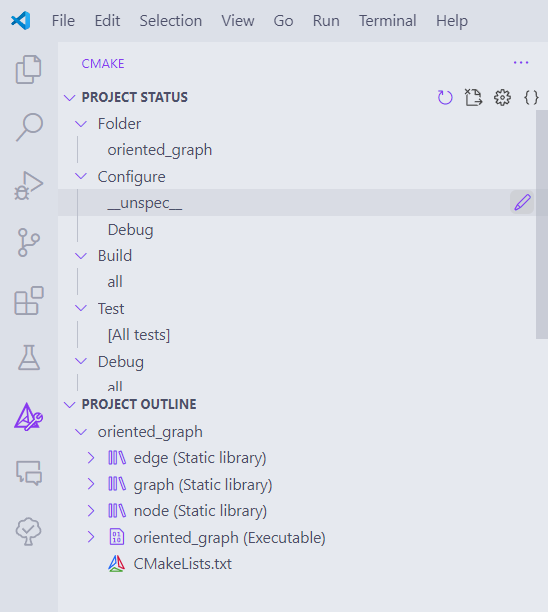
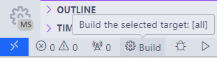
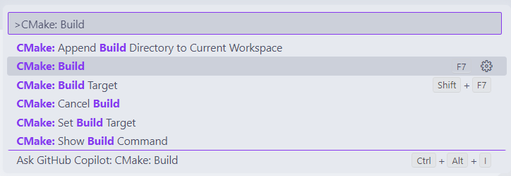
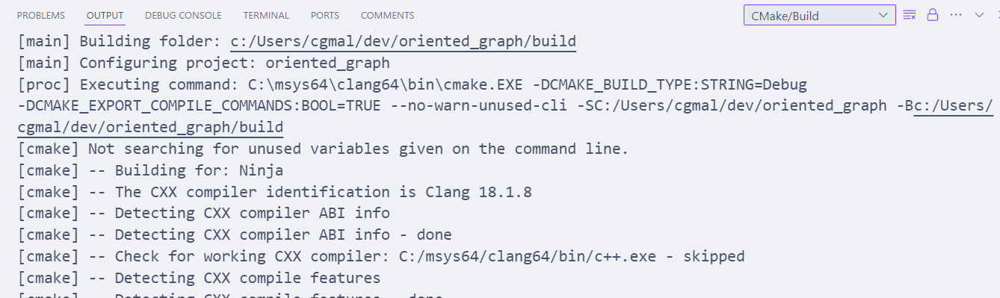
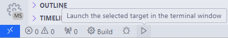
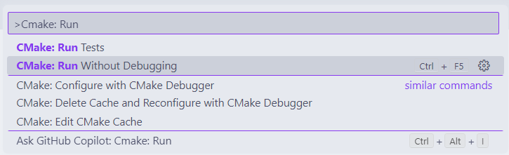
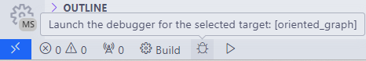
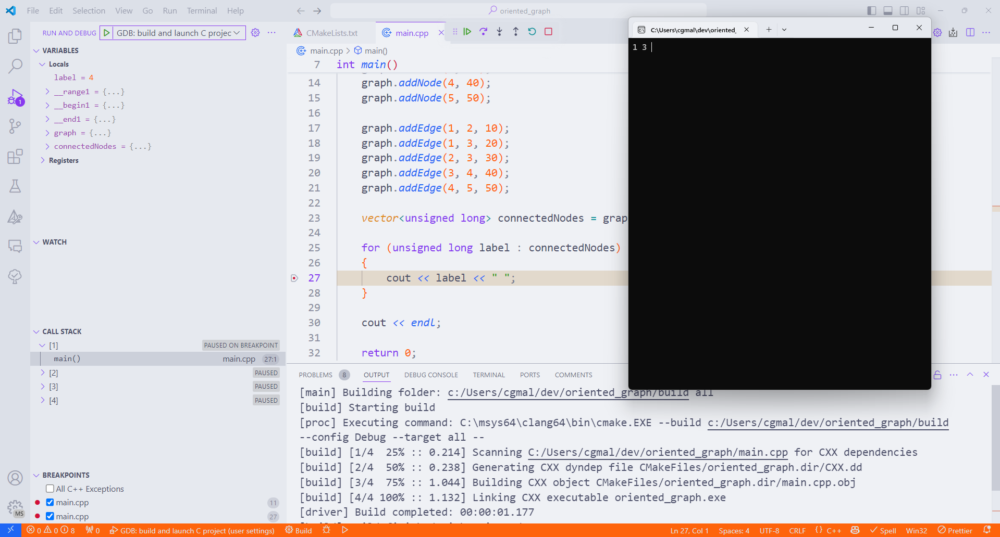

# Cmake Tools no VsCode

Podemos melhorar a experiência de desenvolvimento com CMake no Visual Studio Code utilizando a extensão CMake Tools.
Essa extensão fornece uma interface gráfica para a configuração e compilação de projetos CMake.

Nós já instalamos a extensão no capítulo anterior.
Abra o VsCode no projeto [`oriented_graph`](/code/oriented_graph/).
Pode haver pequenas diferenças entre as configurações geradas pelo CMake Tools e as que fizemos pelo comando do `cmake`
Portanto, **delete** a pasta `/build` criada anteriormente.

Agora, no VsCode, clique no ícone do CMake Tools na barra lateral esquerda.
Essa seção mostra a configuração de compilação do projeto.

No item `Configure`, clique no botão de `lápis` do lado da opção `_unspec_`.
Esse botão tem a função `Select a kit`, em que vamos escolher o compilador que será utilizado.

Selecione o compilador `Clang` no pop-up que aparecer.

Caso não haja o compilador `Clang`, verifique se ele está instalado no seu sistema e suas variáveis de ambiente estão configuradas corretamente.
Então, escolha a opção `[Scan for kits]` para atualizar a lista de kits disponíveis.

## Compilando o projeto

Na barra inferior do VsCode, na parte esquerda, clique no botão `Build`.

Você também pode acessar a mesma opção por meio da **Paleta de Comandos** do VsCode, pressionando `Ctrl+Shift+P` e selecionando a opção `CMake: Build`.

Esse botão executa o comando `cmake -S . -B build` por baixo dos panos, especificando mais algumas opções de compilação.

Em seguida, ele executa também a compilação do projeto, como fizemos anteriormente com o comando `cmake --build build`.

O VsCode imprimirá na seção de `Output` o processo de compilação do projeto.

Você verá que a pasta `/build` foi criada novamente.
Dentro dela, estarão os arquivos de compilação do projeto, e o executável `oriented_graph` gerado.

## Executando o projeto

Com o projeto compilado, você pode executá-lo diretamente pelo VsCode.
Clique no botão com o ícone de `play` na barra inferior do VsCode.
Ele tem a função de `Launch`.

Você também pode acessar a mesma opção por meio da **Paleta de Comandos** do VsCode, pressionando `Ctrl+Shift+P` e selecionando a opção `CMake: Run Without Debugging`.

Na seção de `Terminal` do VsCode, você verá a saída do programa `oriented_graph`, que foi executado.

Perceba que a execução do programa foi feita diretamente pelo VsCode, sem a necessidade de abrir um terminal externo.
O CMakeTools abriu a pasta `/build` (`cd build`) e executou o programa `./oriented_graph`.

## Depurando o projeto

Para depurar o projeto, primeiro precisamos atualizar o arquivo `settings.json` do VsCode.
Por padrão, o CMakeTools tentaria rodar o programa no terminal integrado, mas isso não funciona para a depuração.
Então, devemos configurar o VsCode para rodar o programa em um terminal externo.

Lembre-se: você pode editar as configurações do perfil MSYS2 Clang64 ao abrir a paleta de comandos e pesquisar por **Preferences: Open User Settings (JSON)**.
Substitua o conteúdo do arquivo `settings.json` pelo conteúdo do arquivo [`/config/cmake_settings.json`](/config/cmake_settings.json) deste repositório.

Nele, adicionamos uma nova configuração de depuração para rodar um programa sem antes compilá-lo (dado que o CMakeTools já fez isso).
Também definimos algumas configurações específicas para o CMake.
O nome dessa configuração é `LLDB: launch C++ project`.

Agora, adicione pontos de depuração no código em `main.cpp`.
Então, clique no botão com o ícone de `besouro` na barra inferior do VsCode.
Ele tem a função de `Debug`.

O VsCode abrirá um terminal externo e executará o programa `oriented_graph` em modo de depuração.

---

> ⬅️ [**Capítulo anterior**](/chapters/cmake/text.md)\
> 🏠 [**Página inicial**](/README.md)
