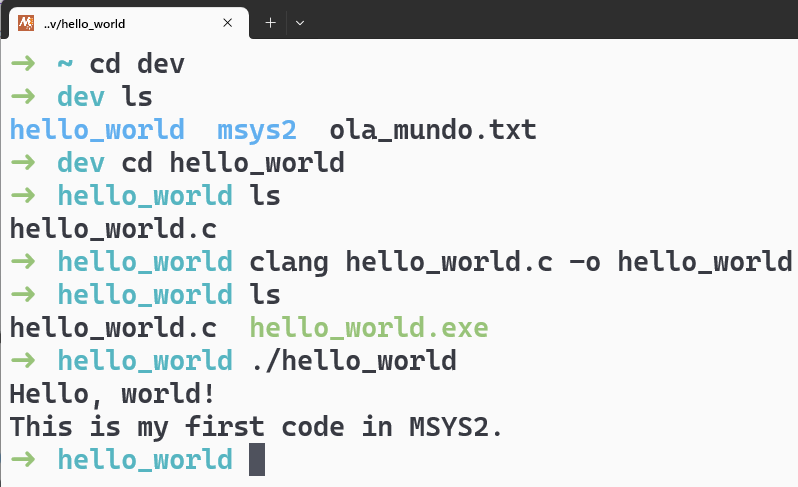

# Compilando um programa em C

Ufa, finalmente terminamos as configurações iniciais!
Agora vamos compilar um programa em C para testar se tudo está funcionando corretamente.

Crie um diretório chamado `hello_world` dentro de `~/dev`.
Dentro dele, crie um arquivo chamado `hello_world.c`.


Abra o arquivo com um editor de texto qualquer e adicione o código abaixo:

```c
#include <stdio.h>

int main() {
    printf("Hello, world!\nThis is my first code in MSYS2.\n");
    return 0;
}
```

Salve o arquivo e volte ao terminal do MSYS2.

## Instalando o compilador

Para compilar o programa, vamos usar o **Clang**.
Lembre-se que incluímos o perfil `CLANG64 / MSYS2` no **Windows Terminal**.
A compilação não funcionará em nenhum outro perfil, nem em outros terminais.

Para instalar pacotes no MSYS2, usamos o `pacman`.
Aqueles voltados para o ambiente CLANG64 são prefixados com `mingw-w64-clang-x86_64-`.
A [documentação oficial](https://www.msys2.org/docs/package-management/) do MSYS2 explica em detalhes como funciona o gerenciamento de pacotes.
Toda a lista de pacotes disponíveis pode ser vista no [repositório do MSYS2](https://packages.msys2.org/).

Vamos instalar o compilador Clang, a ferramenta de compilação Ninja, e outros pacotes necessários.
Para instalá-los, execute o comando abaixo no terminal do MSYS2:

```bash
pacman -S mingw-w64-clang-x86_64-ninja mingw-w64-clang-x86_64-gcc mingw-w64-clang-x86_64-gcc-libs
```

Confirme a instalação digitando `Y` (ou `S`, se estiver em português) e pressionando `Enter`.

Então, execute o comando abaixo e pressione `Enter` para confirmar a instalação dos pacotes:

```bash
pacman -S mingw-w64-clang-x86_64-toolchain
```

## Compilando o programa

O comando de compilação do Clang tem a seguinte estrutura:

```bash
clang [opções] arquivo.c -include -o nome
```

- `[opções]`: são as opções de compilação, como `-c` para compilar sem linkar, `-g` para incluir informações de debug, etc.

- `arquivo.c`: é o arquivo que será compilado.
- `-o nome`: é o nome do arquivo executável de saída.

Assim, com o terminal aberto na pasta `~/dev/hello_world`, execute:

```bash
clang hello_world.c -o hello_world
```

Se tudo estiver correto, você não verá nenhuma mensagem de erro.
Para executar o programa, digite `./hello_world` e pressione `Enter`.



---

> ➡️ [**Próximo capítulo**](/chapters/vscode_to_path/text.md)\
> ⬅️ [**Capítulo anterior**](/chapters/oh_my_zsh/text.md)\
> 🏠 [**Página inicial**](/README.md)
