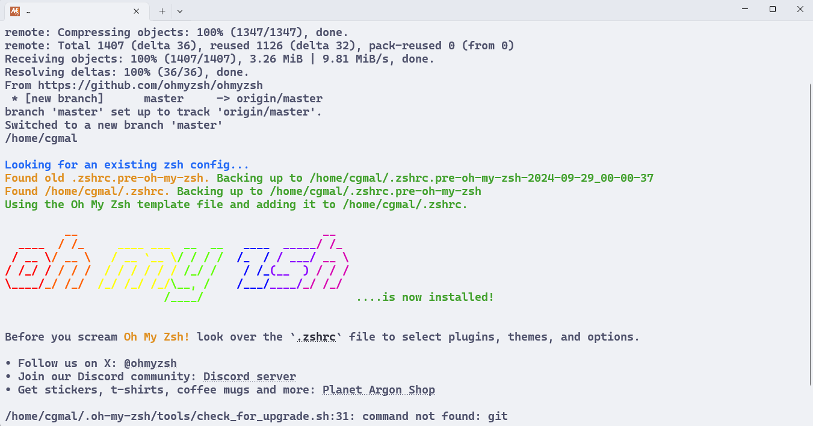
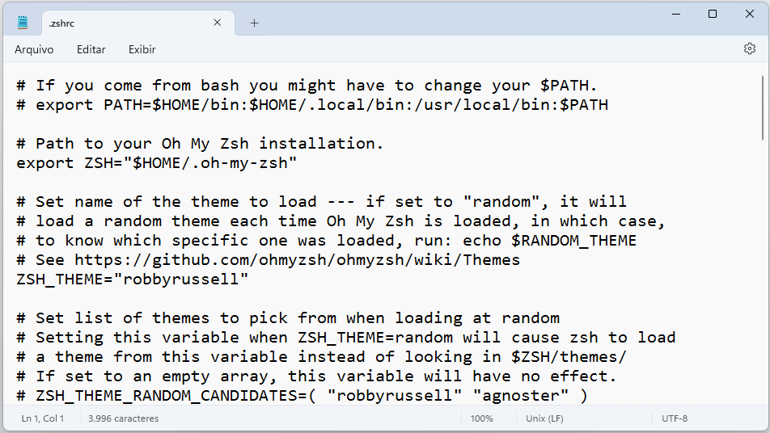
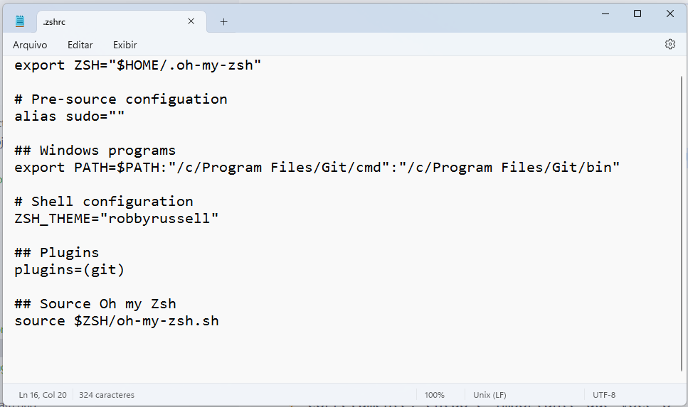

# Instalação do Oh My Zsh

Eu disse que o zsh é um shell mais moderno e poderoso que o bash.
Mas ainda não expliquei por quê.
A resposta é que ele é altamente _customizável_ e _extensível_, graças a uma grande quantidade de _plugins_ e _temas_ disponíveis.

O **Oh My Zsh** é um framework para gerenciar a configuração do zsh.
Suas instruções de instalação estão disponíveis no seu [repositório no GitHub](https://github.com/ohmyzsh/ohmyzsh).

Neste link, você encontrará o comando de instalação.
Execute-o no terminal do MSYS2.

```bash
sh -c "$(curl -fsSL https://raw.githubusercontent.com/ohmyzsh/ohmyzsh/master/tools/install.sh)"
```

O Oh My Zsh instalará vários plugins e temas por padrão.
Após a instalação, você verá uma mensagem de boas-vindas do Oh My Zsh.



Infelizmente, ele substituirá o arquivo `.zshrc` dentro da pasta `/home/[username]`, que nós editamos anteriormente.
Mas não se preocupe, o conteúdo do arquivo original será salvo em um arquivo chamado `.zshrc.pre-oh-my-zsh`.

Edite o arquivo `.zshrc` com um editor de texto qualquer.



Uou, realmente é um arquivo grande!
Mas não se preocupe, todas as linhas que começam com `#` são comentários e não são executadas.
Então, na verdade, não tem quase nada sendo definido no arquivo.

Por isso, vamos **apagar** tudo, e adicionar as seguintes linhas:

```bash
# Path to your Oh My Zsh installation.
export ZSH="$HOME/.oh-my-zsh"

# Pre-source configuation
alias sudo=""

## Windows programs
export PATH=$PATH:"/c/Program Files/Git/cmd":"/c/Program Files/Git/bin"

# Shell configuration
ZSH_THEME="robbyrussell"

## Plugins
plugins=(git)

## Source Oh my Zsh
source $ZSH/oh-my-zsh.sh
```



O Oh My Zsh depende do Git para funcionar corretamente, então é importante que você o defina no _Path_ logo no **começo** do arquivo.
Caso contrário, você poderá ter problemas ao abrir o terminal.
No caso, colocamos-no na seção `Windows programs`.

Como sempre, para atualizar as definições, salve o arquivo, feche o terminal atual e abra um novo.

---

> ➡️ [**Próximo capítulo**](/chapters/compiling_c_code/text.md)\
> ⬅️ [**Capítulo anterior**](/chapters/git/text.md)\
> 🏠 [**Página inicial**](/README.md)
