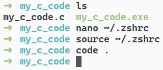

# Adicionando o Visual Studio Code à Path

Para criar projetos maiores, é interessante utilizar um ambiente de desenvolvimento integrado (IDE).
Para este guia, vamos utilizar o **Visual Studio Code**.

Há um comando para abrir o Visual Studio Code diretamente no terminal, que é o `code`.
Entretanto, se você tentar executá-lo, verá que ele não é reconhecido pelo MSYS2.
Isso acontece porque o VsCode não está no Path do MSYS2.

Para resolver isso, você pode adicionar o diretório do executável do Visual Studio Code ao Path, como fizemos com o Git.
Mas dessa vez, vamos editar o arquivo diretamente no terminal.

O MSYS2 tem um editor de texto chamado **nano**.
Ele é um editor de texto simples, que pode ser usado diretamente no terminal.

Precisamos abrir o arquivo `.zshrc` para adicionar o diretório do executável do Visual Studio Code ao Path.

Execute o comando abaixo no terminal do MSYS2:

```bash
nano ~/.zshrc
```

Dentro do nano, adicione a linha abaixo logo após o caminho do Git, substituindo `[username]` pelo seu nome de usuário do Windows:

```bash
export PATH=$PATH:"/c/Users/[username]/AppData/Local/Programs/Microsoft VS Code/bin"
```

O arquivo deve ficar como este:


Para salvar as alterações, pressione `Ctrl` + `O` e `Enter`.
Para sair do nano, pressione `Ctrl` + `X`.

Em vez de fechar o terminal e abrir um novo, você pode recarregar o arquivo `.zshrc` com o comando `source ~/.zshrc`.

Agora, você pode abrir o Visual Studio Code diretamente do terminal com o comando `code`.



---

> ➡️ [**Próximo capítulo**](/chapters/compiling_c_project/text.md)\
> ⬅️ [**Capítulo anterior**](/chapters/compiling_c_code/text.md)\
> 🏠 [**Página inicial**](/README.md)
