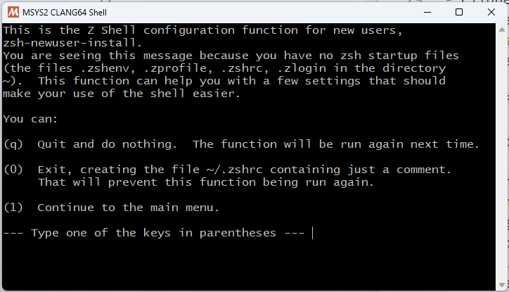
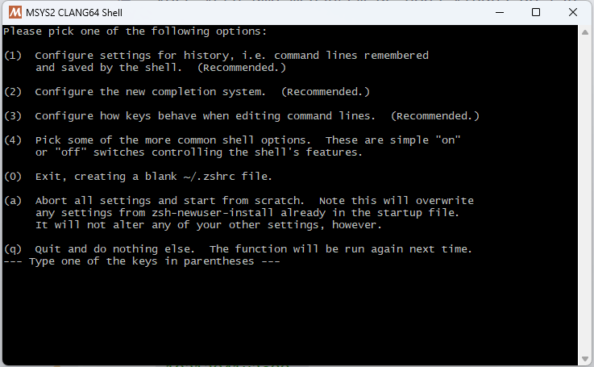
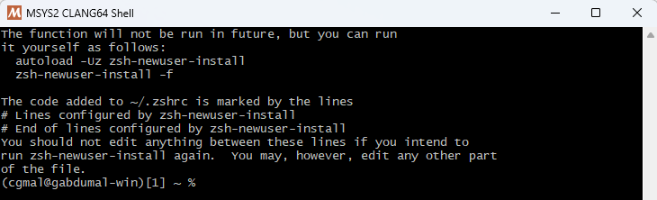

# Instalação do shell ZSH

Vamos trocar o shell do MSYS2 para o **zsh**, que é um shell mais moderno e poderoso que o bash.

Para isso, execute o comando abaixo no terminal do **MSYS2**, para instalar o pacote `zsh`:

```bash
pacman -S zsh
```

Agora precisamos definir o **zsh** como o shell padrão.
Para isso, precisamos definir uma nova variável de ambiente, chamada `SHELL`.
Uma variável de ambiente é um valor que contém alguma informação sobre o ambiente do sistema, e que frequentemente é utilizada por programas.

- Pesquise no menu Iniciar por **Editar as variáveis de ambiente do sistema**.
- Clique em **Variáveis de ambiente**.
- Na janela que abrir, há duas tabelas: `Variáveis de usuário para [username]` e `Variáveis do sistema`.
  - Na tabela de `Variáveis de usuário`, clique em **Novo...**.
    - No campo **Nome da variável**, digite `SHELL`.
    - No campo **Valor da variável**, digite o caminho do executável do zsh, que é `C:\msys64\usr\bin\zsh.exe`.
    - Clique em **OK**.

Aproveitando que estamos aqui, vamos adicionar o diretório do executável do MSYS2 ao **Path**.
O Path é uma variável de ambiente que contém uma lista de diretórios onde o sistema procura por executáveis.

Para que você possa rodar qualquer comando do MSYS2 de qualquer diretório, é necessário adicionar o diretório do executável ao PATH.

- Na tabela de `Variáveis de usuário`, clique em **Path** e depois em **Editar...**.
- Clique em **Novo** e adicione o caminho `C:\msys64\usr\bin`.
- Clique em **OK**.

Agora, feche o terminal atual e abra um novo, ainda do MSYS2 CLANG64.

Você verá uma mensagem de boas-vindas do zsh.
Ele te guiará por um processo de configuração inicial.
Sinta-se à vontade para configurar como desejar.



Para navegar pelas opções, você deve digitar o número ou letra correspondente à opção desejada e pressionar `Enter`.
A fim de configurar, pressione `1` e `Enter`.



Se você não quiser personalizar nenhuma opção, pressione `0` e `Enter`.



---

> ➡️ [**Próximo capítulo**](/chapters/windows_terminal/text.md)\
> ⬅️ [**Capítulo anterior**](/chapters/msys2/text.md)\
> 🏠 [**Página inicial**](/README.md)
